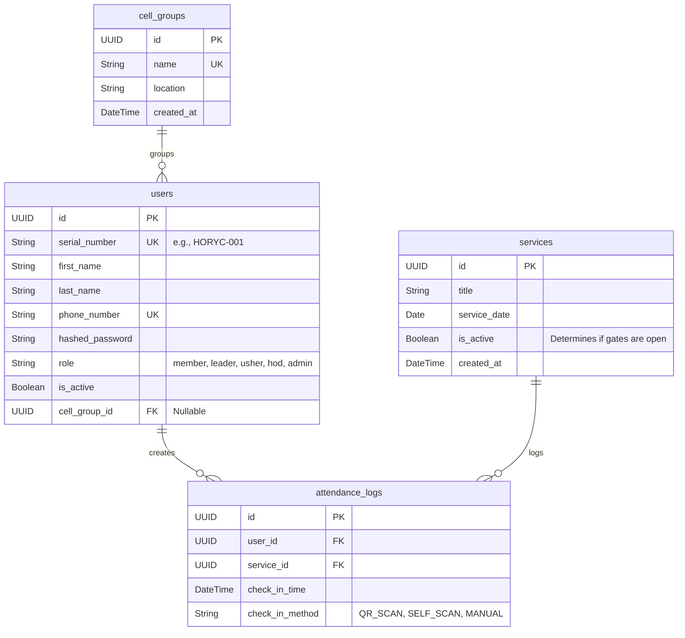

# Database Architecture 🗄️

This document outlines the PostgreSQL database schema for the Two-Way QR Youth Church system. It utilizes UUIDs for primary keys to ensure secure, collision-free scaling and offline data syncs.

---

## Entity-Relationship Diagram (ERD)

---

## Data Dictionary

### 1. `users` Table

The core identity table for everyone from first-timers to the HOD.

| Column | Type | Constraints | Description |
|--------|------|-------------|-------------|
| `id` | UUID | Primary Key | Unique identifier. |
| `serial_number` | String | Unique, Not Null | The `HORYC-XXX` ID used for QR generation. |
| `first_name` | String | Not Null | User's first name. |
| `last_name` | String | Not Null | User's last name. |
| `phone_number` | String | Unique, Not Null | Used for authentication/login. |
| `hashed_password` | String | Not Null | bcrypt hashed password. Default is serial number. |
| `role` | String | Default: `member` | Enum: `member`, `leader`, `usher`, `hod`, `admin`. |
| `is_active` | Boolean | Default: `true` | Soft-delete flag for deactivated members. |
| `cell_group_id` | UUID | Foreign Key | Links to `cell_groups.id`. Nullable. |

---

### 2. `cell_groups` Table

Organizes members into smaller localized units for absentee tracking.

| Column | Type | Constraints | Description |
|--------|------|-------------|-------------|
| `id` | UUID | Primary Key | Unique identifier. |
| `name` | String | Unique, Not Null | Name of the cell (e.g., "Wuse 2 Cell"). |
| `location` | String | Nullable | Physical meeting location. |
| `created_at` | DateTime | Default: `now()` | Timestamp of creation. |

---

### 3. `services` Table

The gatekeeper table. Only one service should be `is_active = true` at a time to allow check-ins.

| Column | Type | Constraints | Description |
|--------|------|-------------|-------------|
| `id` | UUID | Primary Key | Unique identifier. Scanned for Self Check-Ins. |
| `title` | String | Not Null | e.g., "Super Sunday Youth Service". |
| `service_date` | Date | Not Null | The date the service takes place. |
| `is_active` | Boolean | Default: `false` | Master switch. `true` = Gates open. |
| `created_at` | DateTime | Default: `now()` | Timestamp of creation. |

---

### 4. `attendance_logs` Table

The transaction table. It acts as the junction capturing every check-in event.

| Column | Type | Constraints | Description |
|--------|------|-------------|-------------|
| `id` | UUID | Primary Key | Unique identifier. |
| `user_id` | UUID | Foreign Key | The person checking in. |
| `service_id` | UUID | Foreign Key | The service they are attending. |
| `check_in_time` | DateTime | Default: `now()` | Exact timestamp of the scan. |
| `check_in_method` | String | Default: `QR_SCAN` | Enum: `QR_SCAN`, `SELF_SCAN`, `MANUAL`. |